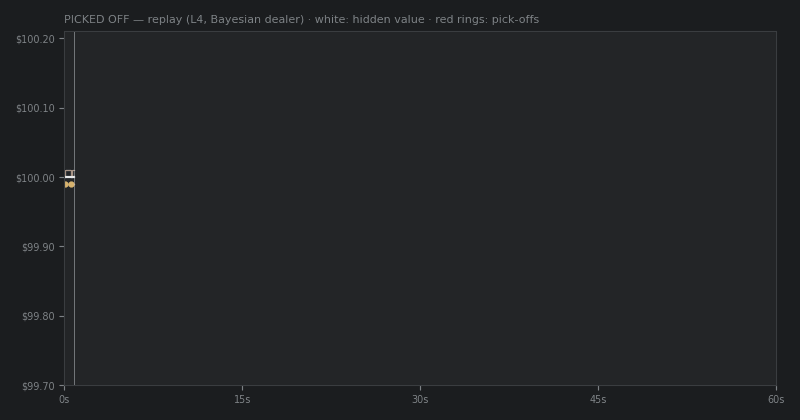

# Picked Off

**Crypto-style market making in 60 seconds: the flow is anonymous, unsegmented, and some of it knows exactly what the asset is worth.** No payment for order flow, no flow labeling, no way to buy protection — you quote a two-sided market against a hidden jumping value, and toxicity is something you infer from the tape (and from the silences) or pay for. Glosten–Milgrom under the hood; your PnL decomposes *exactly* into spread captured + adverse selection + inventory cost, and the post-round replay shows you every trader who picked you off — and every one who looked at your spread and walked.

## ▶ [**PLAY — picked-off.vercel.app**](https://picked-off.vercel.app)



*(Stylized render of the replay screen from a real L4 round — regenerate with `python docs/render_replay_gif.py`, or replace with a screen recording.)*

## How to play

1. Pick a level (α = share of informed flow, 10%→50%); drag your bid/ask lines — or nudge with **W/S** (ask) and **P/L** (bid), Shift = ±5.
2. Tight spreads attract fills; stale quotes attract *informed* fills. Quiet markets mean no customers — or customers who refused your price. You can't tell which.
3. At the close your book is marked at the true value; watch the replay to see who knew what. First visit gets a 30-second tutorial (replayable via "?" on the level screen).

## The honest numbers behind the levels

Levels were calibrated by a **playability gate**: a Bayesian dealer (reads fills *and* silences) must beat a naive fixed-spread dealer by >30% mean PnL over 30 paired seeded rounds. 8 of 72 regimes passed ([grid](notebooks/gate_results.csv)); the shipped one (mean ticks/round):

| Level | α | naive bot | Bayesian bot | edge |
| --- | --- | --- | --- | --- |
| 1 | 0.10 | 144.8 | 114.5 | 0.79× — naive play genuinely wins |
| 2 | 0.20 | 85.9 | 86.8 | 1.01× — parity |
| 3 | 0.30 | 69.4 | 93.7 | 1.35× |
| 4 | 0.40 | 35.1 | 61.1 | 1.74× |
| 5 | 0.50 | 18.2 | 55.6 | 3.05× |

That 0.79× is the design: when flow is harmless, zero-edge "optimal" quoting loses to a wide dumb spread. By level 5, spread income alone cannot survive the toxicity. The arc *is* the game.

## Read more

- **[writeup/writeup.md](writeup/writeup.md)** — the 3-minute version: why crypto MM is a GM problem, calibration results, mechanism, and an n=3 human-vs-bot self-experiment (the human beat the bot twice — and got annihilated once, −872 vs +60, by never repricing after jumps).
- **[DESIGN.md](DESIGN.md)** — the full spec (source of truth): model, exact accounting identity, censoring rationale, golden-vector schema.
- **[notebooks/human_vs_bot.ipynb](notebooks/human_vs_bot.ipynb)** — drop your own session exports into `sessions/` and compare yourself to the Bayesian dealer on the identical stream.

## Repository

| Path | What |
| --- | --- |
| [sim/](sim/) | Python simulator — canonical engine, Bayesian bots, playability gate (236 tests) |
| [web/](web/) | React + TS + Vite game; TS engine verified against the same frozen vectors (25 tests) |
| [vectors/](vectors/) | 12 frozen golden test vectors consumed by both engines, exact integer equality |
| [sessions/](sessions/) | Session exports analyzed by the notebook (add yours) |
| [writeup/](writeup/) · [notebooks/](notebooks/) | Research writeup · gate grid + human-vs-bot analysis |

## Develop

```bash
cd sim && python -m pytest         # Python engine: 236 tests
cd web && npm install && npm test  # TS engine: conformance vs ../vectors
npm run dev                        # play locally
```

MIT — see [LICENSE](LICENSE). Topics: `market-making` · `glosten-milgrom` · `adverse-selection` · `market-microstructure` · `trading-game`
